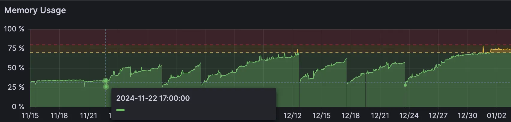
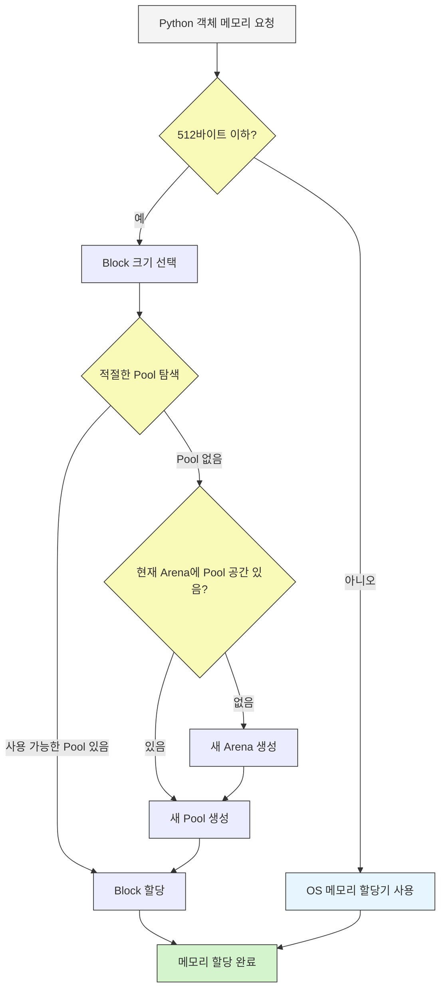

## 메모리 누수가 의심돼요

파이썬은 개발자가 별도로 메모리 관리를 신경쓰지 않아도 내부에서 자동으로 처리한다고 알고 있어, 그동안 메모리 관리를 생각하지 않고 개발했다. 그런데 갑자기 11/22일 배포 이후로 서버 메모리가 계속 증가만 하고 있어, 메모리 누수가 의심된다고 공유를 받았다.



배포 하고 메모리 사용량을 확인하지 않아서 몰랐는데, 대시보드를 확인하니 진짜 특정 배포 이후로 서버 메모리 사용량이 계속 증가만 하고 있었다. 다행히 배포된 내용이 1개라서 디버깅 해야 하는 대상이 바로 정해졌다.
해당 배포 건은 오디오를 읽은 후 파형 그리는 데에 필요한 데이터를 계산하는 작업이었다.

오디오 파일을 객체로 만들 때 `pydub` 패키지를 사용하고 있어, 패키지 내부에서 뭔가 메모리 관리에 문제가 있나 싶었다.
그런데 문득 `pydub.AudioSegment`가 메모리를 많이 잡아 먹는다고 들었던 기억이 났다. 그래서 패키지 쪽 구현 문제라기 보다는 오디오 인스턴스 자체가 메모리를 많이 사용해 발생하는 문제라고 생각이 들었다.
관련해서 찾아보니 `pydub`은 [오디오 데이터를 메모리에서 다룬다는 걸](https://github.com/jiaaro/pydub/issues/89) 확인할 수 있었다.

메모리 사용량이 늘어난 원인은 알았는데, 왜 메모리 사용량이 늘기만 하고 줄어들지 않는 건지 이해가 안됐다. 단순한 생각으로 `AudioSegment` 인스턴스 생성된 이후에 컨텍스트가 종료되면 gc에 의해 메모리에서 해제되지 않을까 싶었는데, 사실은 해제가 안되고 있는 건가 의심이 들었다.
따라서 gc에서 오디오 객체를 메모리에서 해제하고 있는지 확인을 위해 아래 코드로 테스트를 진행했다.

```python
weakref.finalize(audio, lambda: print("audio released"))
```

`audio released` 가 출력되는 걸 확인해, gc에서 오디오 객체의 메모리를 정상적으로 해제하고 있다는 걸 인지했다.
따라서 메모리에서 해제 되는데도 os 메모리 사용량이 줄어들지 않는 이유를 좀 더 찾아봤다.

## 파이썬 메모리 관리 방식
파이썬 메모리 관리 방식을 좀 더 자세히 알아보고자, [문서](https://docs.python.org/3/c-api/memory.html)를 찾아 봤다.
그 결과 파이썬 자체 메모리 관리자에서 객체가 더 이상 필요하지 않으면 해제 하지만, 해제된 메모리를 바로 OS에 반환하지 않고 메모리 풀에서 관리하고 재사용 한다는 걸 알게 됐다.

### pymalloc
- 메모리 관리 시스템으로, 512 bytes 이하의 객체를 빠르게 할당/해제하기 위해 최적화 되어있다.
    - 512 bytes를 초과하는 객체는 os 메모리 할당기를 사용하여 관리한다.
- 작은 메모리 청크를 효율적으로 사용하기 위해 arena, pool, block 계층 구조를 사용한다.

### block

- 가장 작은 메모리 단위로 Python 객체가 실제로 저장되는 공간이다.
- 블록의 크기는 고정되어 있으며, 필요한 크기(8바이트, 16바이트 등)에 맞게 할당된다.
- pool 내에서 관리된다.

### pool

- 풀의 크기는 4KB로 고정이며, 하나의 풀은 동일한 크기의 블록만 포함한다.
- 중간 크기의 메모리 관리 단위이다.

### arena

- OS로부터 메모리를 직접 할당받는 단위로 256KB씩 할당 받는다.
    - 풀은 4KB이기 때문에 아레나는 총 64개의 풀에 메모리를 제공한다.
- OS 메모리에서 가져오므로 파이썬 메모리 관리와 OS 메모리 관리의 연결 고리 역할을 한다.

## 메모리 관리 동작 흐름

1. Python 코드에서 새로운 객체를 생성하면 메모리가 필요하기 때문에 요청을 한다.
2. 512바이트 이하인 경우에는 PyMalloc이 처리하고, 초과인 경우에는 OS 메모리 할당기를 사용한다.
3. PyMalloc은 요청된 메모리 크기에 맞는 Block 크기를 선택한다.
    - ex) 7바이트의 객체인 경우 8바이트 블록 할당
4. 선택된 Block 크기에 맞는 Pool이 있으면 Block을 할당하고, 없으면 새 Pool을 생성한다.
    - 새 Pool 생성 시 현재 Arena에 공간이 있는지 확인하고, 있으면 바로 Pool 생성하고 없으면 새 Arena 생성 후 Pool 생성한다.
5. 사용 가능한 Block이 할당된다.

## OS 메모리 사용량을 줄이기 위해서는?
오디오 인스턴스를 만들 때 메모리를 많이 사용한다. 동시에 여러 오디오 인스턴스를 만들 때 아레나에 할당 가능한 메모리가 없으면 os에서 추가로 메모리를 할당 받아 새 아레나가 생성된다. 즉 PyMalloc이 할당 받은 OS 메모리를 반환은 서버 종료될 때 되기 때문에, 오디오 인스턴스를 api 서버에서 만들지 않는게 제일 좋은 것 같다. 다른 방법은 지금은 잘 모르겠다.

### 2025.01.22 기록
- gunicorn `--max-requests`, `--max-requests-jitter` 를 사용해서 메모리 점유 문제를 해소할 수 있다.
