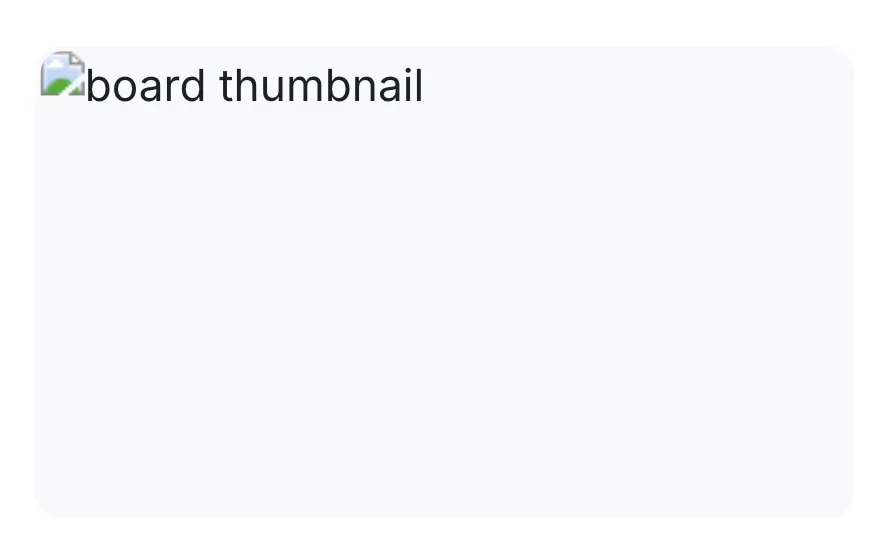
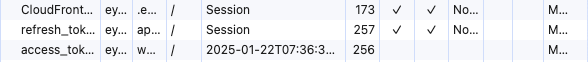

## 이미지를 불러오지 못하고 엑스박스가 뜨는데요?

갑자기 썸네일 이미지에 엑박이 뜬다고 상황을 공유 받았다. 문제가 있는 기기로 가서 네트워크 탭을 확인해보니 cdn url을 호출할 때 403이 발생하고 있었다.
분명 로그인 시에 CF 보안 관련된 쿠키도 발급하고 있어서, 쿠키의 문제는 아니라고 생각했었다. 그런데 저장된 쿠키를 확인해보니 CF 관련 쿠키가 하나도 없었다.

### 디버깅
자리로 돌아와서 CF 쿠키만 없는 경우가 뭐가 있을지 고민했다. 로그인 할 때 같이 발급해주고 있고, 일부로 만료일도 인증 토큰과 동일하게 설정했는데 왜 일까 싶었다.
Application 탭에서 저장된 쿠키를 확인해보니 만료일 설정이 다르게 되어있다는 걸 알게 됐다.

access_token은 만료일이 설정된 persistent 쿠키인데, CF 관련 쿠키는 session 쿠키인 게 문제였다.
즉, 브라우저를 종료했다가 다시 열고 eapy 서비스에 접속했을 때 access_token은 존재해 api 호출에 성공하는데 CF 관련 쿠키는 삭제 돼서 없기 때문에 CF 보안 설정에 의해 403이 발생했던 것이다.

### 해결 및 회고
토큰의 만료일만 신경쓰고 정작 쿠키의 만료를 고려하지 않아서 발생한 문제였다. 백엔드에서 쿠키 설정 시에 max-age를 명시하도록 바꿔, 해당 문제를 해결했다.
보안을 고려해 세션 쿠키를 계속 쓰고자 한다면 access token도 동일하게 세션으로 다뤄서 해결할 수도 있을 것 같다.

## [session cookie](https://developer.mozilla.org/en-US/docs/Web/HTTP/Cookies#removal_defining_the_lifetime_of_a_cookie)
- 브라우저의 현재 세션이 종료되는 경우 자동으로 삭제된다.
- 쿠키 설정 시, max-age 혹은 expires를 설정하지 않으면 session cookie로 간주된다.
  - max-age 혹은 expires를 설정하면 persistent cookie로 간주된다.

### expires
- 쿠키가 삭제되는 만료 날짜를 설정한다. timestamp로 다음과 같은 형식을 따른다.
  - ex) `2025-05-26T09:40:16.822Z`

### max-age
- 쿠키가 삭제될 시간을 초 단위로 설정한다. 쉽게 말해 N초 후 쿠키를 삭제한다는 거다.
- 0 또는 음수는 쿠키를 즉시 만료시킨다.

### expires vs max-age
- expires와 max-age 둘 다 설정된 경우 max-age를 우선해 쿠키가 설정된다.
- max-age 사용을 권장하는데, 그 이유는 안정적으로 쿠키 만료 기간을 설정할 수 있기 때문이다.
  - expires는 사용자 컴퓨터의 날짜를 기준으로 만료되지만, max-age는 현 시점으로 부터 초단위로 유효 기간을 설정하기 때문에 클라이언트의 영향을 받지 않는다.
