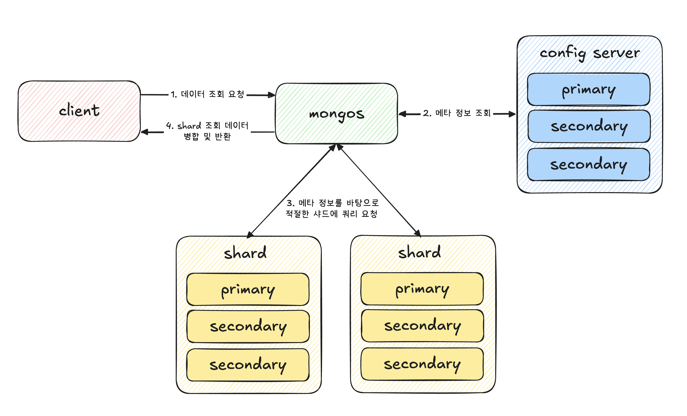

### sharding?
샤딩은 데이터베이스의 데이터를 여러 개의 서버로 분산 저장하는 방식이다.
대량의 데이터를 하나의 서버에서 관리하면 성능과 저장 공간에 한계가 발생하는데, 샤딩을 통해 여러 서버로 나누어 **수평적 확장(Scale-Out)**이 가능하다.

## 구성 요소
MongoDB Sharded Cluster는 `mongos`, `config server`, `shard` 로 구성된다.
- `mongos`: 쿼리 라우터 역할이다.
- `config server`: Shard Key, Chunk 위치 등의 메타데이터를 저장 및 관리하는 역할이다.
- `shard`: 실제 데이터를 저장하는 역할이다.

## 동작 방식

1. 클라이언트가 쿼리를 요청한다.
2. `mongos` 에서 `config server` 에 메타 정보를 읽어온다.
3. 메타 정보를 바탕으로 `mongos` 에서 특정 `shard` 로 쿼리를 요청한다.
4. `shard` 에서 데이터를 받아 병합 후 최종 결과를 반환한다.

---

## 샤딩 방식
### Range-based
특정 범위를 기준으로 데이터를 나눠 저장하는 방식이다. 다만 document의 _id 처럼 자동으로 증가하는 값을 shard key로 설정하면 특정 범위에 데이터가 몰리면서 Hot Spot 문제가 발생할 수 있다.

### Hash-based
shard key 값에 해시 함수를 적용해 데이터를 분배하는 방식이다. 데이터가 몰리지 않고 분산되기 때문에 Hot Spot 문제를 해결 가능하다.
하지만 특정 범위 데이터를 조회하는 경우에는 여러 샤드를 조회해야 해서 성능 저하가 발생할 수 있다.

### Zone-based
특정(ex 지역, 데이터 유형) 기준에 따라 데이터를 저장하는 방식이다. 일반적인 샤딩에서는 mongos가 자동으로 균형을 맞춰주지만, Zone-based 에서는 데이터가 특정 샤드에 강제 할당되기 때문에 자동 리밸런싱이 어렵다. 따라서 데이터 분포를 예측하고 적절한 Zone을 설정해야 한다.

---

## Shard Key
MongoDB에서 데이터를 샤드에 나누는데 기준이 되는 필드이다. 샤딩을 설정할 때 반드시 선택하며, 변경할 수 없다.

### 주의 사항
- 특정 샤드에 데이터가 몰리지 않도록 해야 한다.
- 자동 증가 값 + Ranged-based 인 경우 Hot Spot이 발생할 수 있어, 자동 증가 값을 shard key로 설정하고 싶다면 Hash 기반 방식으로 하는 게 좋다.

## Rebalancing
특정 샤드에 데이터가 몰릴 경우, Balancer가 실행되어 Chunk를 다른 샤드로 이동하는 과정이다. Config Server가 Chunk 개수를 분석하여 불균형을 감지하면 자동으로 실행된다.

다만 밸런싱 중에는 성능 저하가 발생할 수 있어, Balancer 실행 시간을 조정해 트래픽이 적은 시간에 진행하거나 Chunk 크기를 적절히 선택해 과도한 데이터 이동을 방지하면 좋다.
그리고 애초에 shard key를 적절히 선택해 균등하게 데이터가 샤드에 배정되는 게 좋다.
